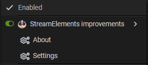

---

# Userscripts

- **ChatGPT Bulk and Quick Delete** 
  
  

- **Steam Inventory Enhancer** 
  
  

- **Steam unfollow all shown curators** 
  
  

- **Twitch Channel Points Bonus Collector** 
  
  

- **Autoreload Streams** 
  
  

- **Highlight and Filter Searchengine Results** 
  
  

- **givee.club & giveaway.su improvements** 
  
  

- **MyFigureCollection Image Downloader** 
  
  

- **Genshin Impact Teyvat Interactive Map - Automate Mark Pins** 
  
  

- **🇩🇪 Kleinanzeigen Verbesserungen** 
  
  

- **🇩🇪 Podcast.de Autodownload** 
  
  

- **z0r Controls** 
  
  

- **Twitch Command Buttons** 
  
  
  
  

- **YouTube HitSquadGodFather Command Buttons** 
  
  

- **Streamlabs HitSquadGodFather improvements** 
  
  

- **🇩🇪 fernsehserien.de episode names as textarea** 
  
  

- **StreamElements improvements** 
  
  

- **ItzaGud.net improvements** 
  
  

**Legend:** 
🟣 Maintained – Actively maintained and updated 
🟠 Obsolete – No longer needed but still functional 
🔴 Deprecated – Outdated, may not work, no further development 
&nbsp;🇩🇪 German - Script is made for a German site so the Readme is in German
---

## Support & Feedback

- **Please read the individual script READMEs first.** 
  Most common questions, features, and usage details are already explained there.
- **For bug reports or issues**, contact me directly on **Discord (Kurotaku)**. 
  Please describe the problem clearly and include steps to reproduce it. 
  Do **not** send random friend requests, just send your message directly with all necessary information.
- **Feature requests and suggestions are welcome.** 
  If you have ideas for improvements, feel free to contact me.

---

## Accessing Script Settings

For most of my userscripts, you can easily access the settings by:
    1. Clicking on your userscript manager's browser extension icon
    2. Click on Settings underneath the Scriptname

**Note:** some scripts have additionally a button directly on the site for faster access.

---

## Important Notes

- I primarily use **Firefox**, so I cannot guarantee full functionality on **Chromium-based browsers**.
- **Tampermonkey** is the recommended userscript manager, but alternatives like **Violentmonkey** and **Greasemonkey** should also work.

### Userscript Managers:
- [Tampermonkey](https://www.tampermonkey.net/)
- [Violentmonkey](https://violentmonkey.github.io/)
- [Greasemonkey](https://www.greasespot.net/)

To keep updates working smoothly, it's best not to modify the userscripts or their required libraries directly.
If you want to make changes, you can create a copy of the script, change the name, and remove the `@updateURL` and `@downloadURL` fields.

---

## Libraries Used

Most of my userscripts share the same core libraries when needed:

- **[SweetAlert2](https://sweetalert2.github.io/)**
  For beautiful, responsive alert dialogs and notifications
- **[GM_config](https://github.com/sizzlemctwizzle/GM_config)**
  For creating customizable configuration panels
- **My own functions library**
  Contains frequently used helper functions and utilities that I use across multiple scripts

*Note: These core libraries aren't explicitly mentioned in each script's documentation. Only additional libraries beyond this standard set are listed.*

---

## License

All userscripts in this repository are licensed under **CC BY-NC-SA 4.0**. 
You are free to share and adapt them for non-commercial purposes, as long as proper credit is given and derivative works are shared under the same license.

For more details, visit: [Creative Commons License](https://creativecommons.org/licenses/by-nc-sa/4.0/)

---

## Disclaimer

These userscripts are provided as-is without any warranty. The developer is not responsible for any potential issues, including but not limited to data loss, security vulnerabilities, or site malfunctions. Use them at your own risk.

