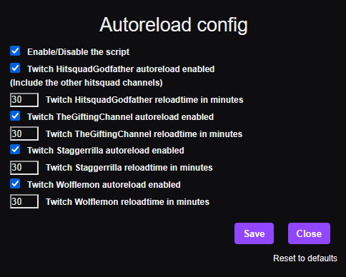

# Autoreload giveaway channel streams

 

---

## Description

This userscript automatically reloads selected **Twitch giveaway channels** after a user-defined amount of time (Default 30 minutes).
The purpose is to keep the stream session active and responsive by reloading it at intervals, helping to avoid missed channel points due to frozen tabs.

Each supported channel can be enabled or disabled individually in the built-in settings panel.
You can also configure the reload interval per channel (in minutes).

---

## Currently supported streamers

- **HitSquadGodFather**
  (automatically includes all Hitsquad-related substreams)
- **TheGiftingChannel**
- **Staggerrilla**
- **Wolflemon**

> ❌ **LootNova** is no longer supported, as the channel became a scam.

