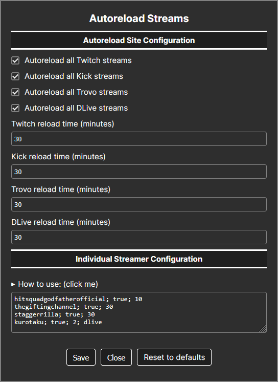

# Autoreload Streams

---

## Description

This userscript automatically reloads streams from different Livestream websites after a user-defined amount of time.
It keeps the stream session active and responsive by reloading it at intervals, preventing freezing or crashing of the player.

You can configure global autoreload per platform or per individual streamer.
Each streamer can have a custom reload time and optional site restriction.

---

## Features
- Auto reloads streams to prevent freezing/crashing
- Global or per-streamer configuration
- Per-streamer reload interval (minutes)
- Enable/disable per streamer
- Optional site restriction (`twitch`, `kick`, `trovo`, `dlive`, multiple via `|`)

---

## Supported sites
- **Twitch.tv**
- **Kick.com**
- **Trovo.live**
- **dlive.tv**

---

## Configuration format
Inside the settings panel, one line per streamer: 
`streamername; true/false; time_in_minutes; [optional: sites]`

### Examples
- `hitsquadgodfather; true; 30` → Reload every 30 minutes on all supported sites
- `somekickstreamer; true; 20; kick` → Reload only on Kick every 20 minutes
- `sometrovostreamer; true; 25; trovo` → Reload only on Trovo every 25 minutes
- `multistreamer; true; 15; twitch|trovo` → Reload on Twitch **and** Trovo every 15 minutes
- `disabledstreamer; false; 30` → Disabled

---

## Notes
-
- `"true"` = autoreload enabled, `"false"` = disabled
- If no site is specified, the rule applies to **all supported sites**
- Global site autoreload settings are applied if no streamer-specific match is found
- Reload will not occur if the page URL changes before the scheduled reload
- The script only works if you open the streamer directly via URL or reload after the stream has started, some websites like Twitch load content dynamically without a full page refresh, so autoreload may not trigger otherwise

---

## Screenshot
