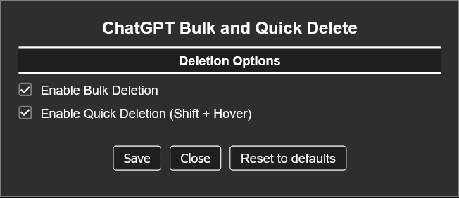

If you like my work feel free to support me on: 

# ChatGPT Bulk and Quick Delete

---

## Description

This userscript adds bulk and quick deletion functionality to the ChatGPT sidebar.
It allows selecting multiple chats for sequential deletion with progress popup.
You can also quickly delete single chats using Shift + Click on the Trashbin.
And you can export the current opened chat as a TXT file.

All deletions are performed using ChatGPT’s internal backend API.

---

## Features
- Bulk deletion of multiple chats via selection mode
- Quick delete of single chats using Shift + Click
- Export the currently opened chat as a TXT file

---

## Screenshot

