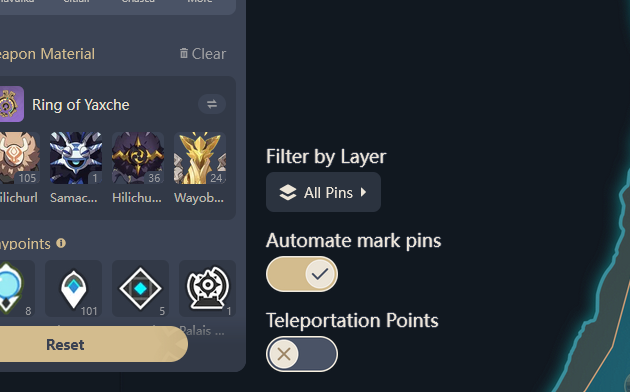

**If you like my work feel free to support me on:** 

# Genshin Impact Teyvat Interactive Map - Automate Mark Pins

---

## Description

This userscript adds a toggle button to the [Genshin Impact Teyvat Interactive Map](https://act.hoyolab.com/ys/app/interactive-map).

When enabled, all triggered popups will automatically click the "Mark Pin" button, making it faster to mark everything you collected on the map.

 
*This is how it looks like on the map*