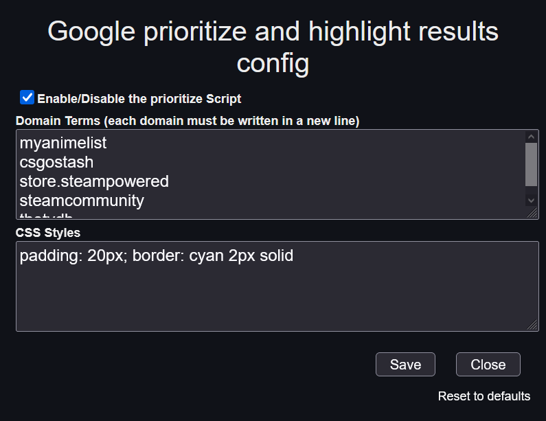
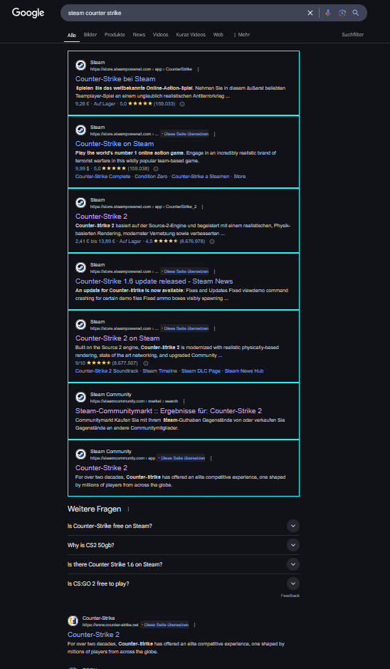

# Google prioritize and highlight results

[](https://gist.github.com/Kurotaku-sama/ce96f72ac5bb51c7246b51b3b18a30c7/raw/Google%2520prioritize%2520and%2520highlight%2520results.user.js) [](https://gist.github.com/Kurotaku-sama/ce96f72ac5bb51c7246b51b3b18a30c7)

---

## Description

This userscript enhances Google search results by prioritizing and highlighting domains from your preferred websites. It creates a dedicated section at the top of search results for matching domains.

---

## Features

- **Priority Domain Section** - Creates a container at the top of results for matched domains
- **Custom Styling** - Applies your chosen CSS styles to highlighted results
- **Flexible Matching** - Works with partial domain matches (e.g., "steamcommunity" matches "steamcommunity.com")
- **Order Preservation** - Maintains your configured domain priority order
- **Responsive Design** - Adapts to different Google search layouts

---

### Domain Terms
- Enter one domain or partial domain per line without http:// https:// or www.
- Example entries:
  ```
  store.steampowered
  steamcommunity
  github.com
  ```

### CSS Styles
- Customize the appearance of prioritized results, no classes allowed
- Default: `padding: 20px; border: cyan 2px solid`



---

## Example


