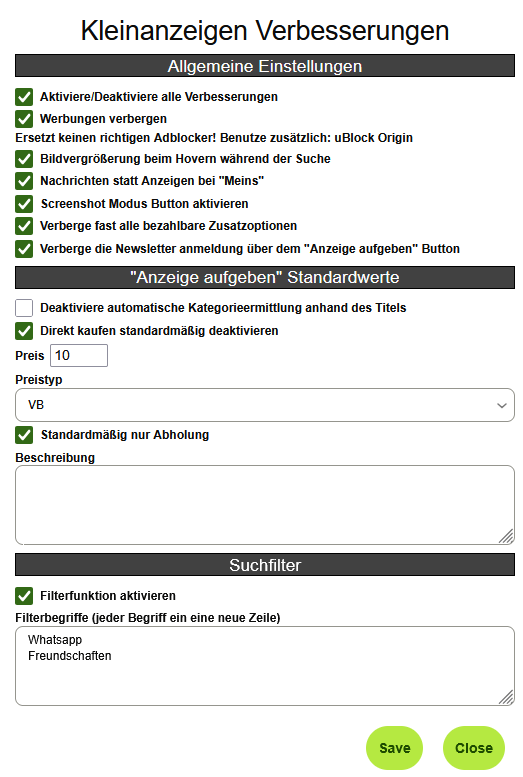
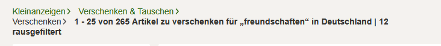
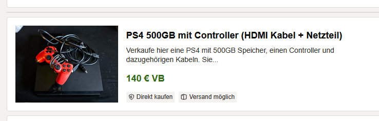
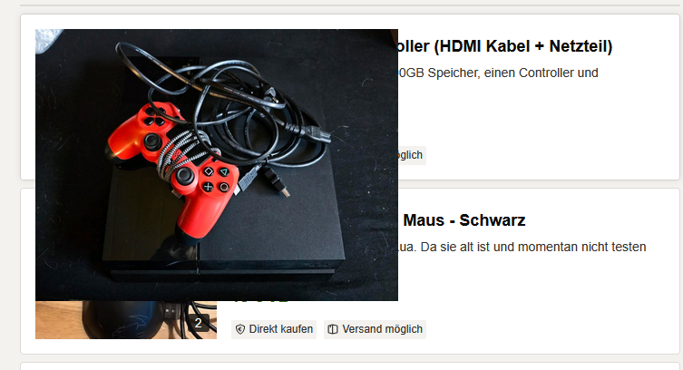

# Kleinanzeigen Verbesserungen

> This is a userscript for the German website **[kleinanzeigen.de](https://www.kleinanzeigen.de)**, therefore the following text is written in German.

 

---

## Funktionen

Dieses Script erweitert **kleinanzeigen.de** um nützliche Features und Verbesserungen, die sich direkt über ein Einstellungsmenü ein- und ausschalten lassen.

- **Werbung ausblenden** (ersetzt keinen richtigen Werbeblocker)
- **Bildvorschau bei Maus-Hover vergrößern**
- **„Meins“-Menü zur Nachrichtenübersicht umleiten**
- **Screenshot-Modus in der Nachrichtenansicht**
- **Bezahlbare Zusatzoptionen verbergen**
- **Newsletter-Checkbox automatisch verbergen**

---

## Anzeige aufgeben: Standardwerte

In der „Anzeige aufgeben“-Maske lassen sich über das Script bestimmte Felder vorausfüllen oder deaktivieren:

- Automatische Kategorievorschläge deaktivieren
- „Direkt kaufen“-Option standardmäßig ausschalten
- Standartwerte für: Preis, Preistyp, Beschreibung und Abholung

Empfehlenswert, wenn vieles auf einmal eingestellt wird und man ständig alles neu ausfüllen muss.

---

## Suchfilter

Mit der integrierten Filterfunktion kannst du unerwünschte Anzeigen auf Basis bestimmter Wörter im Titel automatisch ausblenden.

- Begriffe werden zeilenweise angegeben
- Die Groß- und Kleinschreibung der Begriffe ist egal (case-insensitive Filterung)
- Gefilterte Einträge werden sofort aus der Liste entfernt
- Die Anzahl der entfernten Einträge wird oben in der Übersicht angezeigt

Ideal, um direkt die Leute auszublenden, die die „Zu verschenken“-Kategorie missbrauchen, um WhatsApp-Gruppen zu promoten oder verzweifelt nach „Freundschaften“ zu suchen. 
ᴵᶜʰ ʰᵃˢˢᵉ ᵈᶦᵉˢᵉ ˡᵉᵘᵗᵉ ˢᵒ ˢᵉʰʳ

## Bildvorschau

