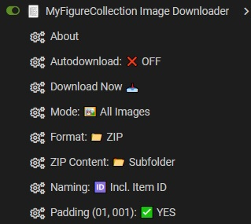

# MyFigureCollection Image Downloader

---

## Description

This userscript allows you to download images for items from MyFigureCollection (MFC) either automatically when the page loads or manually via an integrated button. All settings, including download modes and file formatting, are easily adjustable through your userscript manager's menu.

---

## Settings

- **Autodownload**: Automatically starts the download process when an item page is loaded.
- **Mode (Primary Only / All Images)**: Choose between downloading only the main product image or the entire gallery.
- **Format (ZIP / Single Files)**: Toggle between packing images into a ZIP archive or downloading them individually.
- **ZIP Content (Subfolder)**: When using ZIP, creates a subfolder inside the archive named after the figure.
- **Naming (Item ID)**: Includes the MFC Item ID in the filename (e.g., `12345_01.jpg`).
- **Padding**: Adds leading zeros to filenames (e.g., `01`, `001`) to ensure correct sorting in your local file system.

---

## Note

Due to issues with some userscript managers regarding the `@require` of large libraries, **JSZip** is loaded dynamically during each ZIP download process. This ensures that archiving works reliably without the script hanging during initial page load.

---

## Libraries Used

- **JSZip**: For creating ZIP archives directly in the browser.