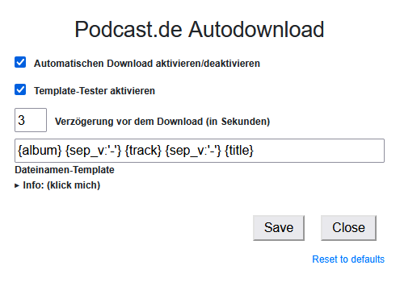
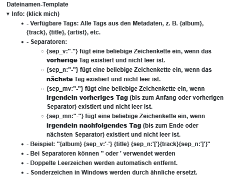
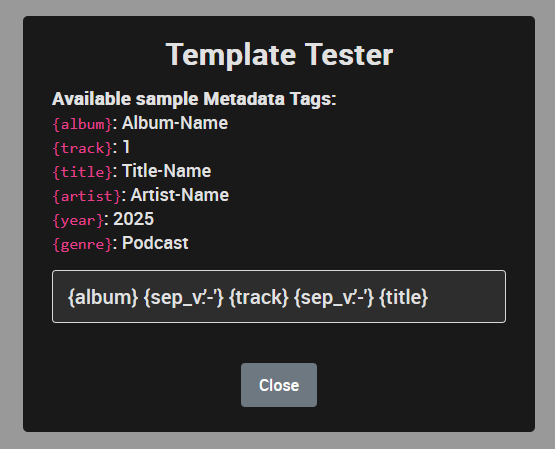

# Podcast.de Autodownload

> This is a userscript for the German website **[Podcast.de](https://www.podcast.de)**, therefore the following text is written in German.

 

---

## Funktionen

- **Automatischer Download**: Ermöglicht das automatische Herunterladen von Podcast-Episoden beim öffnen der Episodenseite.
- **Benutzerdefinierte Dateinamen-Templates**: Ermöglicht es, benutzerdefinierte Vorlagen für die Dateinamen der heruntergeladenen Dateien festzulegen, basierend auf Metadaten (z. B. `{album}`, `{track}`, `{title}`, usw.).
- **Template-Tester**: Eine Funktion, mit der du deine benutzerdefinierten Vorlagen testen kannst, um zu sehen, wie der Dateiname aussehen würde.

---

## Nutzung

1. **Einstellungen konfigurieren**: Nach der Installation kannst du die Konfiguration öffnen, indem du auf das Tampermonkey-Icon klickst und "Einstellungen" auswählst.
2. **Automatischer Download**: Wenn aktiviert, wird das Script die Episoden automatisch herunterladen wenn du die Episodenseite besuchst und die Verzögerung abgelaufen ist.
3. **Dateinamen-Template**: Lege dein bevorzugtes Format für die Dateinamen fest, indem du Metadaten-Tags verwendest (wie `{album}`, `{track}`, usw.).
4. **Template Tester**: Nutze die Template-Tester-Funktion, um eine Vorschau der Dateinamen mit deinem Template zu sehen.

---

## Tags für Dateinamen-Templates

- **Verfügbare Tags**: Alle Metadaten-Tags sind verfügbar, z. B. `{album}`, `{track}`, `{title}`, `{artist}`, usw.
- **Separator-Tags**:
  - `{sep_v:"-"}`: Fügt einen Trenner zwischen zwei Tags ein, wenn das vorherige Tag existiert und nicht leer ist.
  - `{sep_n:"-"}`: Fügt einen Trenner zwischen zwei Tags ein, wenn das nächste Tag existiert und nicht leer ist.
  - `{sep_mv:"-"}`: Fügt einen Trenner zwischen einem beliebigen vorherigen Tag (bis zum ersten Trenner oder Beginn der Vorlage) ein, wenn dieses Tag existiert und nicht leer ist.
  - `{sep_mn:"-"}`: Fügt einen Trenner zwischen einem beliebigen nachfolgenden Tag (bis zum letzten Trenner oder Ende der Vorlage) ein, wenn dieses Tag existiert und nicht leer ist.

---

## Konfiguration

- **Automatischer Download**: Aktivieren oder deaktivieren Sie die automatische Download-Funktion.
- **Template-Tester**: Aktivieren oder deaktivieren Sie die Template-Tester-Funktion.
- **Download-Verzögerung**: Legen Sie eine Verzögerung vor dem Start des Downloads fest (in Sekunden).
- **Dateinamen-Template**: Definieren Sie, wie die Dateinamen für die heruntergeladenen Episoden generiert werden.

 
*Einstellungen*

 
*Einstellungen mit geöffneter Infobox*

 
*Template Tester*

---

## Templates

**Beispiel-Template:**
- `{album} - {title}` 
    → MeinPodcast - Interview.mp3
- `{track} - {title}` 
    → 42 - Die große Episode.mp3

**Templates mit dynamischen Trennern:**
- `{album}{sep_v:' - '}{title}` 
    → Ohne Album: Sonderfolge.mp3 
    → Mit Album: MeinPodcast - Sonderfolge.mp3
- `{album}{sep_v:' - '}{track}{sep_n:'. '}{title}` 
    → MeinPodcast - 42. Die Episode.mp3
- `{album} {sep_v:'-'} {title} {sep_n:'['}{track}{sep_v:']'}` 
    → Ohne Track: MeinPodcast - Die Folge.mp3 
    → Mit Track: MeinPodcast - Die Folge [5].mp3
- `{album} {sep_mn:'['}{track} {title}{sep_mv:']'}` 
    → Ohne Track aber mit Titel: MeinPodcast [Die Folge].mp3 
    → Ohne Titel aber mit Track: MeinPodcast [5].mp3 
    → Ohne Track und Titel: MeinPodcast.mp3

**Praxisbeispiele:**
- Für Hörbücher 
   `{album}{sep_v:' - '}Kapitel {track}{sep_n:': '}{title}` 
    → Mein Hörbuch - Kapitel 5: Der Kampf.mp3
- News-Podcast 
   `{album} {date}{sep_n:' - '}{title}` 
    → DailyNews 2024-05-12 - Wirtschaft.mp3

---

## Verwendete Bibliotheken

- **[jsmediatags](https://github.com/aadsm/jsmediatags)**
  Zum Auslesen der ID3-Tags aus MP3-Dateien, um Metadaten wie Titel, Album und Künstler zu erhalten