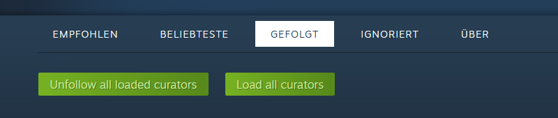

# Steam unfollow all shown curators

 

---

## Description

This userscript adds two buttons to the Steam curator page under:
https://store.steampowered.com/curators/mycurators

The buttons allow you to:
- Automatically scroll and **load all curators** shown on the page
- **Unfollow all loaded curators** with a single click

Useful for cleaning up your curator list without manually clicking each one.

---

## How it works

1. Click **"Load all curators"** to scroll through the page until no more curators are loaded.
2. After the loading is complete, click **"Unfollow all loaded curators"** to remove all visible curators from your follow list.
3. The process includes basic UI feedback (progress bar, final confirmation).

This script only unfollows all that are visible on the site.

---

## Notes

- The script inserts buttons both below the navigation bar and at the bottom of the curator list.
- A short delay is used between each unfollow action to prevent rate-limiting or loading issues.
- Loading detection checks when the visible curator count stops increasing.
