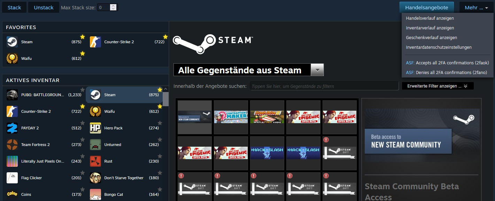
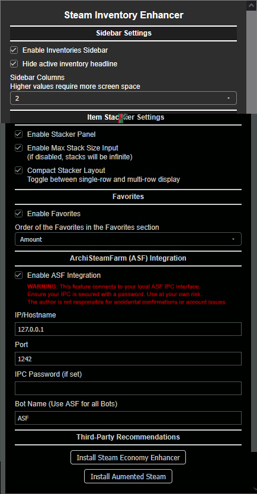

# Steam Inventory Enhancer

---

## Description

This userscript enhances the Steam inventory experience by adding essential quality-of-life features. It allows you to manage large quantities of items easily through stacking and unstacking tools, provides a customizable favorites system for faster game navigation, and integrates with ArchiSteamFarm (ASF) for seamless 2FA management.

---

## Features

### Item Stacker & Unstacker
- **Mass Stacking:** Merge all identical items in your inventory with a single click.
- **Smart Stacking:** Set a maximum stack size limit to organize items into specific quantities.
- **Unstacking:** Split large stacks of items back into individual units automatically.
- **Progress Tracking:** Real-time dual progress bar showing current item status and overall completion.

### Inventory Favorites
- **Pin your Games:** Add a star to your most-used inventories to keep them at the top.
- **Custom Sorting:** Sort your favorites by Name, Item Amount, or the date they were added.
- **Clean UI:** Clones the original Steam look for a native feel while providing faster access.

### ASF Integration (IPC)
- **Remote 2FA:** Accept or deny all mobile confirmations directly from the Steam inventory "More" menu.
- **Configurable:** Works with your local or remote ArchiSteamFarm instance via IPC.

---

## Settings

---

## How it works

1. **Stacking:** The script uses the Steam WebAPI to combine items. It calculates the necessary "Combine" operations and executes them with a delay to prevent rate limits.
2. **Favorites:** Clicking the star icon saves the AppID to your local storage. The script then clones the original navigation tabs into a new "Favorites" section.
3. **ASF:** Commands are sent via `GM_xmlhttpRequest` to your ASF IPC address. Ensure IPC is enabled in your ASF global config.

---

## Important Security Warnings (ASF)

- **2FA Risk:** Using the ASF option is always a risk, as it theoretically allows skipping 2-Factor Authentication steps. By using this feature, you accept this security trade-off.
- **Credential Storage:** Your ASF IPC password will be stored in the userscript's local storage. This is a potential security risk if unauthorized persons gain access to your browser data.
- **Connection Security:** If you use this feature, you should use **HTTPS** for your ASF IPC connection whenever possible to prevent "Man-in-the-Middle" attacks.
- **ASF Requirements:** For ASF to perform 2-Factor confirmations, you must have imported your Steam mobile credentials (e.g., from a Steam Desktop Authenticator `.mafile`) into ASF. 
*Please note: I do not provide instructions or guides for this import process.*

---

## Notes

- **Inspiration:** The functionality of this script was inspired by the works of **Chr_** and **SteamDB**.
- **SteamDB Extension Conflict:** If you are using the SteamDB browser extension with its sidebar enabled, you must **disable the SteamDB sidebar** in the extension settings to prevent layout conflicts with this script.