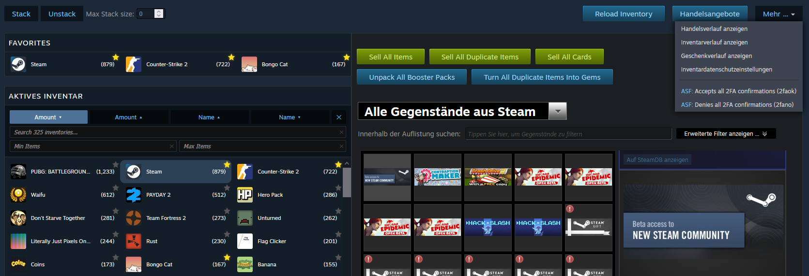

# Steam Inventory Enhancer

---

## Description

This userscript enhances the Steam inventory experience by adding essential quality-of-life features. It provides a customizable sidebar for better navigation, powerful mass stacking/unstacking tools, a favorites system, a comprehensive filtering and sorting menu, and ASF integration for seamless 2FA management.

---

## Features

### Customizable Sidebar
- **Dynamic Layout:** Transform the standard inventory navigation into a flexible sidebar.
- **Adjustable Rows:** Manually choose between **1 to 4 rows** in the settings to perfectly fit your screen resolution and number of inventories.

### Item Stacker & Unstacker
- **Mass Stacking:** Merge all identical items in your inventory with a single click.
- **Smart Stacking:** Set a maximum stack size limit to organize items into specific quantities.
- **Unstacking:** Split large stacks of items back into individual units automatically.
- **Progress Tracking:** Real-time dual progress bar showing current item status and overall completion.

### Favorites System
- **Pin your Games:** Add or remove games from your favorites with a single click on the star icon.
- **Dedicated Section:** Favorited inventories are cloned into a separate, easy-to-access section at the top.
- **Custom Sorting:** Sort your pinned inventories by Name, Item Amount, or the date they were added.

### Inventory Filtering
- **Advanced Search:** Find specific game inventories instantly with a real-time search field.
- **Amount Range:** Filter inventories by item count using Min and Max fields.
- **Multi-Sort:** Toggle between Name and Amount sorting (Ascending ▴ / Descending ▾).
- **Quick Reset:** Clear individual filters or reset everything with a single click.

### ASF Integration (IPC)
- **Remote 2FA:** Accept or deny all mobile confirmations directly from the Steam inventory "More" menu.
- **Configurable:** Works with your local or remote ArchiSteamFarm instance via IPC.

---

## Settings

---

## How it works

1. **Sidebar:** The script restructures the inventory navigation tabs into a grid layout based on your row selection.
2. **Stacking:** Uses the Steam WebAPI to calculate and execute "Combine" operations with built-in delays to prevent rate limits.
3. **Favorites:** Saves selected AppIDs to local storage and highlights them with a custom star icon.
4. **Filtering:** Caches inventory nodes and applies real-time CSS filtering and DOM reordering based on user input.
5. **ASF:** Sends commands via `GM_xmlhttpRequest` to your ASF IPC interface.

---

## Important Security Warnings (ASF)

- **2FA Risk:** Using the ASF option is always a risk, as it theoretically allows skipping 2nd Factor steps.
- **Credential Storage:** Your ASF IPC password is stored in the userscript's local storage.
- **Connection Security:** Use **HTTPS** for your ASF IPC connection to prevent "Man-in-the-Middle" attacks.

---

## Notes

- **Manual Adjustment:** You must manually set the number of rows (1-4) in the settings to match your display size.
- **Inspiration:** Inspired by the works of **Chr_** and **SteamDB**.
- **SteamDB Conflict:** Disable the **SteamDB sidebar** in their extension settings to prevent layout issues.