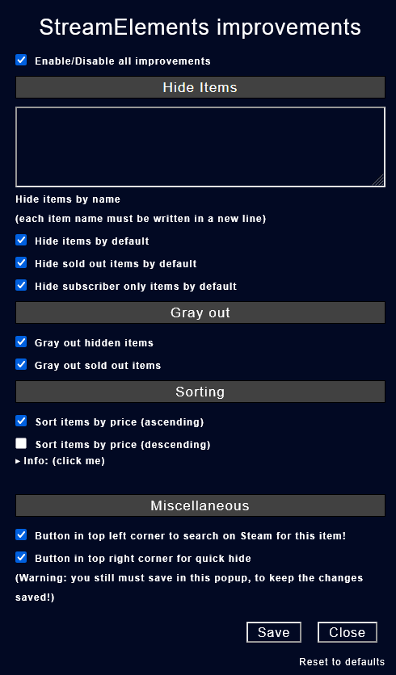

# StreamElements improvements

---

## Description

This userscript improves the functionality of StreamElements store pages by adding filters, advanced sorting, and UI enhancements. It allows you to hide specific items, automatically gray out sold-out entries. Extra sidebar controls and buttons make interaction smoother.. All features are fully configurable through the settings.

---

## Features

### Item Visibility

- **Hide items by name** 
  Specify item names (one per line) to hide them from the store. 
  This applies globally across **all** StreamElements stores — not per channel.
- **Hide items by default** 
  Automatically hide your configured items on page load.
- **Hide sold out items** 
  Optionally hide items that are out of stock.
- **Hide subscriber-only items** 
  Hides items that are exclusive to subscribers.
- **Gray out hidden items** 
  Store items get a gray filter.
- **Gray out sold out items** 
  Store items get a gray filter.

### Sorting

- **StreamElements default Sorting** 
  ~~Set the store's default sorting to: Newest, Subscriber only, Cost, or leave it as-is.~~ 
  Removed due to changes on their frontend

- **Sort by price (ascending/descending)** 
  Adds price-based sorting that can override the default.

#### Note regarding the Sorting:
- ~~If *"StreamElements default Sorting"* is not "Default", it takes precedence over ascending/descending.~~
- "Ascending" dominates over "Descending".
- If "Cost" and "Ascending" are selected, it will work.
- If either checkbox is enabled, normal sorting may not work!
- I recommend using the checkboxes for faster sorting!

### Miscellaneous

- **Steam search button** 
  Adds a button to each item for a quick Steam lookup.
- **Quick-hide button** 
  Allows you to hide an item directly from the UI via a small button. Remember to save your changes afterward!
- **Full-width layout** 
  The script forces the store layout to use the full width of your screen, removing StreamElements default size constraints. 
  Especially useful on larger displays where the default layout wastes a lot of space. This option is always active.

---

## Sidebar Features

The script adds a sidebar panel to the left of the StreamElements store under the normal sidebar, giving you fast access to additional tools and toggles:

- **Toggle visibility options** 
  Instantly show or hide:
  - Hidden items
  - Sold out items
  - Subscriber-only items

- **Get Itemlist** 
  Outputs a plain-text list of all visible item names to your browser console for easy copy/paste into the hide list.

- **Show Items as Table** 
  Replaces the store view with a sortable table containing:
  - **Name**
  - **Description**
  - **Price**
  - **Stock**

  You can also download the table as a **CSV file** for further analysis or record-keeping.

- **Show Redemption History** 
  Opens your StreamElements redemption history in a new tab with a single click.

---

## Important

If you hide items directly using the eye icon in the store UI, make sure to **save the changes** in the config popup afterward.
Otherwise, the hidden list will not persist after reloading the page.

Unlike most of my other scripts, this one also provides a **dedicated config button in the sidebar**, making it easier to access and manage your settings at any time with one click.

---

## Known Issues

StreamElements uses a dynamic frontend, meaning using the navigation does not fully reload the site.

- The script will only initialize if the store page is opened directly — such as through a bookmark or by refreshing the browser tab.