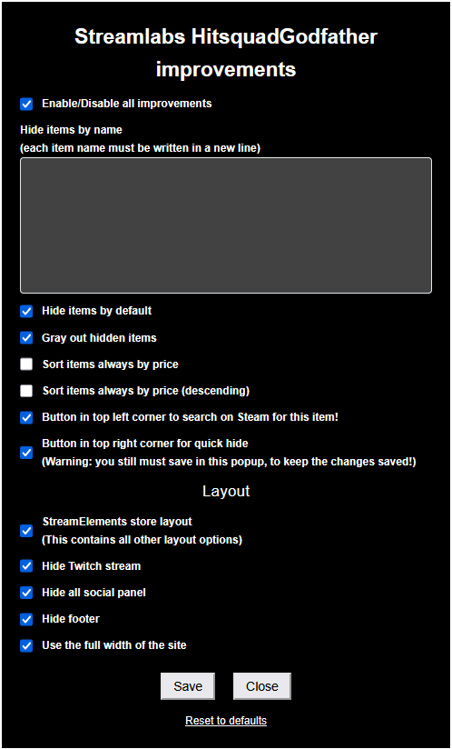
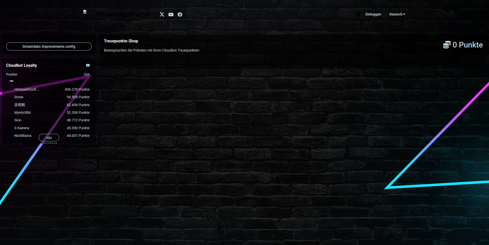

# Streamlabs HitsquadGodfather improvements

## Info

This script is no longer required for its original purpose, as **HitsquadGodfather is no longer streaming on YouTube**.
However, it may still serve as a reference or toolkit for similar use cases.

 

---

## Features

- You can **hide store items** completely, or just **gray them out**
- **Sort items by price**, either ascending or descending
- Add a **Steam search button** directly to each item

**Important**: When hiding items, you **must still save** your changes in the config panel for them to take effect!

### Layout

- Switch to a layout that is almost identical to **StreamElements**, this includes the other 4 layout options
- Alternatively, **disable individual elements** like Twitch stream, footer, or social panels
- Optionally **use the full page width** for a better experience

