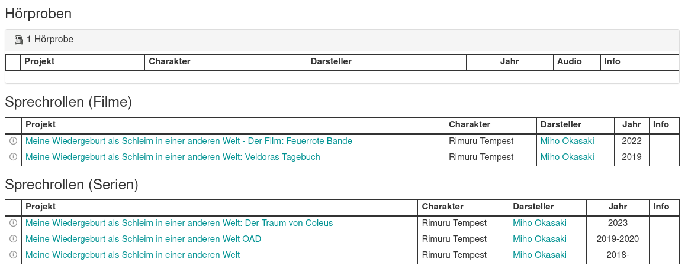
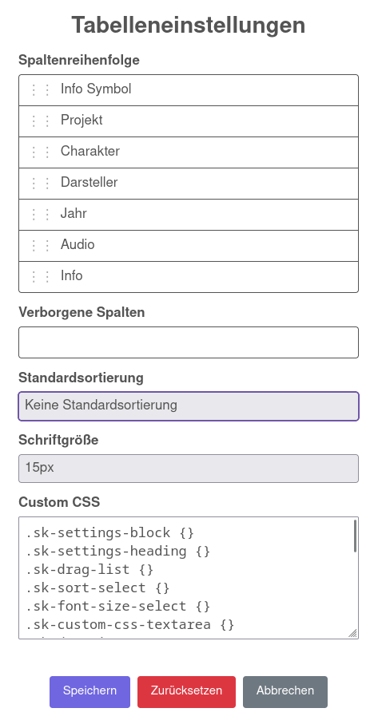

**If you like my work feel free to support me on:** 

# Synchronkartei Tabellenübersicht

> This is a userscript for the German website **[synchronkartei.de](https://www.synchronkartei.de)**, therefore the following text is written in German.

---

## Beschreibung

Dieses Script wandelt die Listen auf Synchronsprecher-Profilseiten von [synchronkartei.de](https://www.synchronkartei.de) in übersichtliche, sortierbare Tabellen um.
Spaltenreihenfolge, Sichtbarkeit, Standardsortierung, Schriftgröße und Aussehen lassen sich vollständig über ein Einstellungsmenü anpassen.

Zusätzlich wird oberhalb der Listen eine Live-Suche eingeblendet, mit der sich Projekt, Charakter oder Darsteller direkt filtern lassen.

---

## Funktionen

- **Automatische Umwandlung** aller Listen (z. B. Rollen, Hörproben, Dialogbuch, Dialogregie) in Tabellen
- **Konfigurierbare Spalten**: Icon, Projekt, Charakter, Darsteller, Jahr, Audio, Info
- **Spalten ein-/ausblenden und per Drag & Drop neu anordnen**
- **Sortierbare Spalten** per Klick auf die Kopfzeile
- **Standardsortierung** frei wählbar (z. B. Projekt aufsteigend, Jahr absteigend)
- **Live-Suche** über Projekt, Charakter und Darsteller
- **Anpassbare Schriftgröße** (10–20px)
- **Custom CSS** für individuelles Styling der Tabelle
- Automatische Sonderbehandlung für Dialogbuch-/Dialogregie-Seiten (ohne Charakter/Darsteller-Spalte) sowie die Hörproben-Sektion (inkl. Audio-Player)

---

## Einstellungen

Über den Menübefehl **„Einstellungen“** im Userscript-Manager öffnet sich ein Dialog mit folgenden Optionen:

- **Spaltenreihenfolge**: Sichtbare Spalten per Drag & Drop sortieren
- **Verborgene Spalten**: Spalten per Drag & Drop aus- oder wieder einblenden
- **Standardsortierung**: Feld und Richtung für die automatische Sortierung beim Laden der Seite
- **Schriftgröße**: Schriftgröße der Tabelle in 1px-Schritten von 10 bis 20px
- **Custom CSS**: Eigene CSS-Regeln für alle verwendeten Klassen der Tabelle und des Einstellungsmenüs

Über den Button **„Zurücksetzen“** lassen sich alle Einstellungen jederzeit auf die Standardwerte zurücksetzen.

---

## Hinweise

- Da synchronkartei.de Anzeige nicht zu 100% konsistent ist, kann es in seltenen Fällen vorkommen, dass Zeilen falsch zugeordnet werden, z. B. der Charakter in der Darsteller-Spalte
- Ist bereits ein Sortierparameter (`?sortierung=...`) in der URL vorhanden, wird die konfigurierte Standardsortierung nicht angewendet, um die native Sortierung der Seite nicht zu überschreiben
- Auf Dialogbuch- und Dialogregie-Seiten entfallen die Spalten Charakter und Darsteller automatisch, da diese dort nicht vorhanden sind
- Die Audio-Spalte wird nur in der Hörproben-Sektion angezeigt
- Vorhandene Audio-Player werden in die Tabelle verschoben statt geklont, wodurch ihre Funktion vollständig erhalten bleibt
