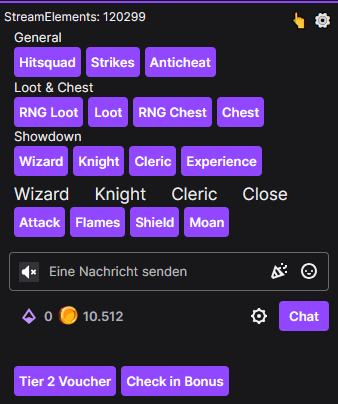
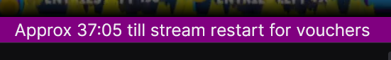

# Twitch command buttons

### This script is available in three versions, tailored for each specific streamer:

**[HitSquadGodFather](https://www.twitch.tv/hitsquadgodfather)** 

 **[Staggerrilla](https://www.twitch.tv/staggerrilla)** 

 **[LootNova](https://www.twitch.tv/lootnova)** 

> ⚠️ **Note:** I do not maintain these scripts anymore as HitSquadGodFather got banned sadly and LootNova became a scam channel.

---

## Table of Contents

- [Description](#description)
- [Core Functions](#core-functions)
  - [Voucher Buttons](#voucher-buttons)
  - [IRC (Recommended)](#irc-recommended)
  - [Miscellaneous](#miscellaneous)
- [Streamer Specific Buttons](#streamer-specific-buttons)
  - [HitSquadGodFather](#hitsquadgodfather)
    - [Loot & Chest Buttons (Quick Access)](#loot--chest-buttons-quick-access)
    - [Loot & Chest Buttons (Full List)](#loot--chest-buttons-full-list)
    - [Trivia Buttons](#trivia-buttons)
    - [Showdown Class Selection](#showdown-class-selection)
  - [Staggerrilla](#staggerrilla)
  - [LootNova](#lootnova)
- [Known Issues](#known-issues)
- [Libraries Used](#libraries-used)

---

## Description

This userscript adds a compact interface to supported Twitch channels that allows you to send chat commands without having to type them manually.

It works directly in the chat view and is tailored for each streamer, offering quick access to commonly used commands.

You can fully configure the script through the built-in settings panel. This includes enabling or disabling individual features and button groups, so you only see what you actually use.

The interface can also be moved freely on the page, allowing you to place it wherever it fits your setup best.

For advanced usage, the script can optionally send messages through IRC instead of the chat input field, which helps avoid issues like shadowbans.

 

 
*You can drag it with the hand once its popped out* 
*You can pin it again with the needle to the chat prompt*

---

## Core Functions

These settings are shared across all versions of the script (with some minor differences depending on the streamer). You can configure them via the built-in settings panel.

### Voucher Buttons

Adds a set of buttons to quickly redeem available vouchers (e.g., tier bonuses or daily check-ins).

- You can enable/disable the entire voucher button group.
- In some versions (e.g., **HitSquadGodFather**), you can also toggle each individual voucher button.

### IRC (Recommended)

The script can use Twitch IRC to send messages instead of relying on the web chat input.

- **Why use IRC?** It allows you to see whether your commands are actually being delivered. Without it, Twitch might shadowban you without any visible indication.
- To enable IRC, you need to provide your **Twitch username** and an **OAuth token**.

You can generate your token here: [twitchtokengenerator.com](https://twitchtokengenerator.com)

### Miscellaneous

Additional options to improve usability and automation:

- **Show StreamElement Points**
  Uses the StreamElements API to show your current loyalty points (if the channel uses StreamElements).

- **Collect Point Bonus Automatically**
  Automatically claims the channel point bonus that appears every 15 minutes. No need anymore for BTTV or other scripts.

- **Desktop notification if message contains your name**
  Sends a desktop notification when someone in chat mentions your name.

- **Hide Power-Ups in Store**
  Hides the Bit-based “Power-Ups” in the Twitch channel store interface.

- **Twitch Store bulk purchase** *(only for HitSquadGodFather)*
  Adds a quantity selector and a "Bulk Purchase"   button to the Twitch Channel Points reward store. Allows purchasing rewards multiple times automatically (useful for rewards where multiple entries increase your chances, for example in Gleam giveaways). 

- **Show approx stream restart timer** *(only for HitSquadGodFather)*
  Displays an estimated countdown until the next stream restart (based on typical voucher reset behavior). 

- **Prevent Shadowban**
  Randomizes the casing of your commands (e.g., `!PoInTs`) to reduce the risk of Twitch auto-filtering your messages.

- **Custom CSS Styles**
  Add your own CSS to change the appearance of Twitch or the command button panel. Ideal for advanced users who want visual customization without touching the script itself.

---

## Streamer Specific Buttons

Some button types *(like **Loot**, **Chest**)* support "Target Buttons" — these open a temporary panel where you simply click a number to choose a target.
This helps keep the interface clean and compact.

### HitSquadGodFather

**General Buttons:**
- `!hitsquad`
- `!strikes`
- `!anticheat`

#### Loot & Chest Buttons (Quick Access)

These buttons are always visible when enabled without overwhelming the interface:

- **RNG Loot** – Use a random number for `!loot`
- **Loot (Target)** – Use target panel to pick 1–8
- **RNG Chest** – Use a random number for `!chest`
- **Chest (Target)** – Use target panel to pick 1–8

#### Loot & Chest Buttons (Full List)

This section shows all individual `!loot1–8` and `!chest1–8` buttons.

> Disabled by default. The **Target Buttons** above are recommended, as showing all 16 buttons takes up a lot of space.

#### Trivia Buttons
- `!answer1`, `!answer2`, `!answer3`, `!answer4`
- `!triviapoints`

#### Showdown Class Selection
Choose your class to open the correct set of buttons for your match:
- **Wizard**
- **Knight**
- **Cleric**
- **Experience**

---

### Staggerrilla

**General Buttons:**
- `!bleep`
- `!bloop`
- `!bleep !bloop`
- `!join`

---

### LootNova

**General Buttons:**
- `!arrow`
- `!battle`
- `!gamecoins`

---

## Known Issues

Due to how Twitch dynamically loads content, userscripts like this one do **not automatically initialize** when navigating between pages inside Twitch.

- The script will only run if the stream is **opened directly**, for example by **reloading the page** or **opening it without using Twitch's internal navigation** (e.g. from a bookmark).
- If you switch to another streamer without reloading, the script may continue running in the background, which can **lead to unexpected behavior**.

**Recommended usage:**
Always open a stream directly or reload the page after switching to a different channel to ensure the script initializes (or unloads) properly.

---

## Libraries Used

Most of my userscripts share the same core libraries when needed:

- **[Interact.js](https://interactjs.io/)**
  Used to enable drag-and-drop for the command button panel.
- **Command Button Library**
  A custom library I've built specifically for this type of Twitch command scripts.
  It handles all the logic for rendering, targeting, styling, and interaction of the command buttons –
  allowing each streamer version to stay lightweight and making it easy to extend the script for new channels with similar mechanics.