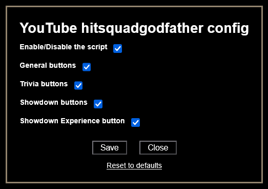

# YouTube hitsquadgodfather command buttons

## Info

This script is no longer required for its original purpose, as **HitsquadGodfather is no longer streaming on YouTube**.
However, it may still serve as a reference or toolkit for similar use cases.

 

---

## Description

This userscript adds a panel with command buttons similar like the old version of **[Twitch command buttons](/userscripts/Twitch%20command%20buttons/README.md)** to the YouTube live chat interface, specifically designed for on-stream minigames used during HitsquadGodfather's streams.

Each button sends a specific command into the live chat. This was intended to speed up interactions during events like trivia, team battles, or RPG-style encounters in the stream.

---

## Features

- Adds grouped command buttons for:
  - General commands (`!hitsquad`, `!points`, etc.)
  - Trivia answers (1–4)
  - Showdown Buttons
- Targeting system for Showdown attacks
- Optional toggle for each group in the config
- Sends commands into chat via simulated input and button clicks
- Works only when the page contains `HitsquadGodfather` in the live chat

---

## Notes

- Buttons appear only if the live chat contains `HitsquadGodfather`
- The script may still be useful as a base for similar live chat automation tasks