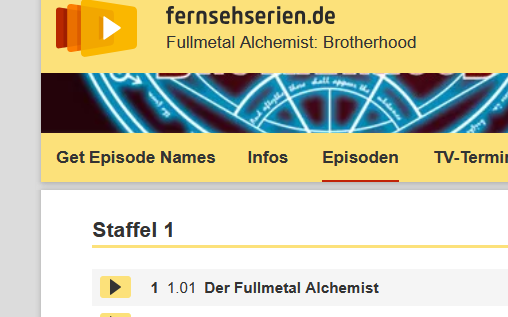
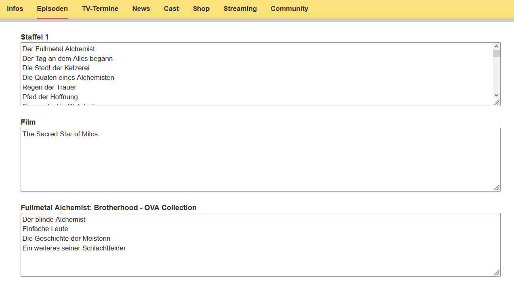

# fernsehserien.de episode names as textarea

> This is a userscript for the German website **[fernsehserien.de](https://www.fernsehserien.de)**, therefore the following text is written in German.

 

---

## ⚠️ Keine Weiterentwicklung

> Dieses Script wird **nicht mehr weiterentwickelt**, da ich inzwischen komplett auf [FileBot](https://www.filebot.net) umgestiegen bin.
> FileBot ist deutlich flexibler und erledigt vieles automatisch.
> Trotzdem funktioniert das Script weiterhin und kann in einfachen Fällen nützlich sein.

---

## Was macht das Script?

Auf Episodenguide-Seiten von [fernsehserien.de](https://www.fernsehserien.de) wird ein Button namens **„Get Episode Names“** eingefügt.

Nach einem Klick zeigt das Script für jede Staffel ein Textfeld (`<textarea>`) mit allen Episodentiteln dieser Staffel an.
So kannst du die Folgenamen einfach kopieren – z. B. für:

- [Bulk Rename Utility](https://www.bulkrenameutility.co.uk/)
- [MERU – Massive Episode Rename Utility](https://github.com/Kurotaku-sama/MERU-Massive-Episode-Rename-Utility) (mein eigenes Tool)
- oder andere Programme zum Umbenennen von Dateien

---

## Beispiel: Menü-Button

So sieht der eingefügte Menüeintrag aus:

---

## Beispiel: Ausgabe

So sieht die Ausgabe mit den Textfeldern für jede Staffel aus:

