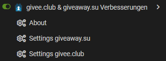
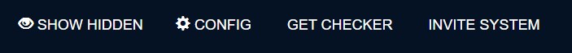

# givee.club & giveaway.su improvements

---

## Description

This userscript enhances the giveaway experience on both [**givee.club**](https://givee.club) and [**giveaway.su**](https://giveaway.su), offering better visibility control, UI improvements, and quality-of-life features to help you navigate and manage giveaways more efficiently.

Originally, a separate script was planned for giveaway.su based on user feedback — however, during development, I made the decision to merge both scripts into a single unified script with nearly identical functionality across both sites.

---

## Features

- Remove sponsored content from the giveaway list on givee.club
- Ability to hide giveaways so you just see new ones
- Add quick-hide buttons to all giveaway cards
- Toggle hidden items on the main page with a toggle button
- Adds config and visibility toggle buttons directly to the site interface
- Display exact giveaway draw time on event pages
- Adds buttons to automatically perform or check tasks

 

Like all my other scripts, the configuration can also be accessed via the userscript/add-on menu.
However, each platform — **givee.club** and **giveaway.su** — has its **own individual settings**, allowing you to customize behavior separately for each site.

---

## Buttons in the Interface

The script adds two new buttons:
- One to open the configuration menu
- One to show/hide previously hidden giveaway items

These are integrated directly into the site for quick access:

 
*Buttons in give.club*

 
*Buttons in giveaway.su*

---

## Recommended: Giveaway Companion

For additional automation and integration, it's recommended to also install [**Giveaway Companion**](https://raw.githubusercontent.com/longnull/GiveawayCompanion/master/GiveawayCompanion.user.js).

This script is not created by me, but I use it myself and highly recommend it for many giveaway platforms, like **Gleam.io**. 
A one-click install button for it is available in the configuration panel.

---

## Notes

- The list of hidden items is auto-sorted and cleaned
- The configuration menu and toggle visibility are also accessible directly via new site buttons